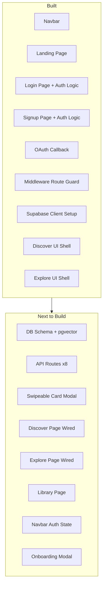

# NicheVibe — Implementation Status vs PRD

## What Has Been Built

### Infrastructure & Config

- Next.js 16 project with TypeScript, Tailwind CSS v4, Framer Motion — `next.config.ts`, `tsconfig.json`
- Environment variables wired — `.env` with Supabase URL, anon key, service role key
- Custom favicon using `app/icon.tsx` (teal gradient lightning bolt)
- Supabase browser client — `lib/supabase/client.ts` (`createClientComponentClient`)
- Supabase server + admin clients — `lib/supabase/server.ts`
- Edge-compatible session middleware — `middleware.ts` (using `@supabase/ssr`, protects `/discover` and `/library`, redirects auth pages for signed-in users)

### Feature 3.6 — Authentication System (COMPLETE — UI + Logic)

- Login page — `app/(auth)/login/page.tsx`
  - Email/password sign-in (`signInWithPassword`)
  - Google OAuth (`signInWithOAuth` with `access_type: offline`)
  - Forgot password flow (`resetPasswordForEmail`)
  - Error/success alert system with animated feedback
  - Loading states, input validation, friendly error messages
- Signup page — `app/(auth)/signup/page.tsx`
  - Username + email + password fields
  - Password strength indicator
  - `signUp` with `user_metadata` (username, display_name)
  - Duplicate email detection
  - Email verification success screen
  - Google OAuth signup
- OAuth callback — `app/auth/callback/route.ts` (code-for-session exchange)
- Protected routes enforced via `middleware.ts`

### Landing Page (COMPLETE — UI Only)

- `app/page.tsx` — composes three sections
- `app/components/Navbar.tsx` — fixed nav with logo, DISCOVER/EXPLORE/LIBRARY links, SIGN UP button (linked to `/signup`), responsive mobile slide-out menu
- `app/components/HeroSection.tsx` — animated headline, badge, CTA buttons, stats, floating anime cards, particles, ambient orbs
- `app/components/HowItWorks.tsx` — 3-step process section
- `app/components/PickAVibe.tsx` — 18 mood tag pills, max 6 selections, "EXPLORE VIBE" button

### Feature 3.1 — Seed-Based Discovery (UI Shell Only)

- `app/discover/page.tsx` — search bar, filter icon, 10 hardcoded anime card grid
- No autocomplete, no API call, no vector search, no similarity scores

### Feature 3.2 — Mood Cloud / Tag-Based Discovery (UI Shell Only)

- `app/explore/page.tsx` — 6 vibe preset cards, 20 manual mood tags (max 5 selectable), "RUN DISCOVERY" button
- No API call, no embedding logic, no results returned

---

## What Is Left to Build (MVP Scope Only)

The items below follow the PRD roadmap phases in order.

### Phase 1 remaining — Backend Foundation

- Supabase database schema not yet created:
  - `anime_library` table (with `vector(768)` embedding column)
  - `user_library` table (with status, episode, rating, notes)
  - `user_preferences` table
- pgvector extension not configured
- RLS policies not written
- Database functions not created (`match_anime`, `get_random_niche_shows`)
- Google AI Studio API key not added to `.env`

### Phase 2 remaining — Core Features

**Data Pipeline (PRD §4.1)**

- n8n workflow: AniList GraphQL → embedding generation → Supabase batch insert
- Database seeded with 100–500 anime titles with embeddings

**API Routes (PRD §7) — none exist yet**

- `app/api/discover/route.ts` — POST, vector similarity search
- `app/api/embed/route.ts` — POST, generate Google AI embedding for a query
- `app/api/explore/route.ts` — POST, tag-based centroid embedding search
- `app/api/search/autocomplete/route.ts` — GET, fast title typeahead
- `app/api/library/add/route.ts` — POST
- `app/api/library/update/route.ts` — PATCH
- `app/api/library/remove/route.ts` — DELETE
- `app/api/library/list/route.ts` — GET

**Swipeable Card Modal — Feature 3.3 (PRD §3.3) — not started**

- Full-screen modal/overlay triggered after search or explore
- Tinder-style card stack (350×500px desktop)
- Framer Motion drag-to-swipe with 100px threshold and spring physics
- Card content: cover image, title, synopsis, mood tags, similarity %, niche rank
- Skip (left) / Add to Library (right) controls
- Progress indicator ("Card 3/20")
- Toast notification on library addition
- Touch + mouse support

**Discover page wired up (PRD §5.2)**

- Replace hardcoded anime list with real API call to `/api/discover`
- Add working autocomplete (calls `/api/search/autocomplete`)
- Loading state ("Analyzing semantic vibe… Finding hidden gems…")
- Connect results to swipeable card modal

### Phase 3 remaining — Exploration & Library

**Explore page wired up (PRD §5.3)**

- Connect "RUN DISCOVERY" button to `/api/explore`
- Vibe starter presets send example shows as query seeds
- Tag selection sends centroid embedding query
- Results feed into the shared swipeable card modal

**Library page — Feature 3.4 — not started**

- `app/library/page.tsx` — entire page missing
- Tab navigation: Watching / Completed / Plan to Watch / On Hold / Dropped
- Library card component: cover, title, episode X/Y, status badge, star rating
- Detail modal: status dropdown, episode +/- counter, 1-10 star rating, text notes, Update + Remove buttons
- Auto-timestamp on status transitions

**Navbar auth state**

- Navbar currently always shows SIGN UP — needs to conditionally show user avatar/logout when a session exists

### Phase 4 remaining — Launch Polish

- Onboarding welcome modal (post-signup: "I know what I like" → `/discover` vs "I want to explore" → `/explore`)
- Error monitoring (Sentry)
- Performance: Next.js Image component for cover art, virtual scroll for library
- Accessibility audit (WCAG 2.1 AA)
- Vercel deployment + production env vars

---

## Visual Summary

